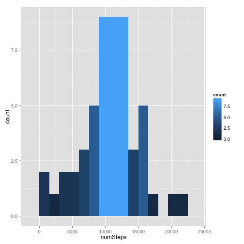
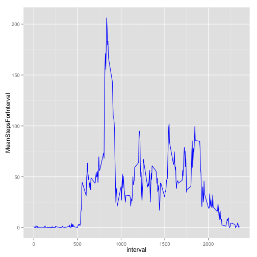
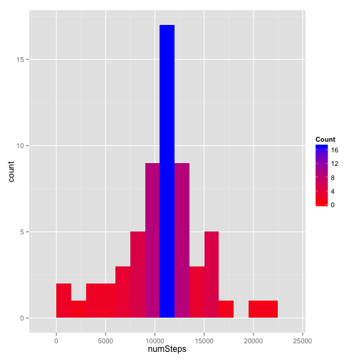
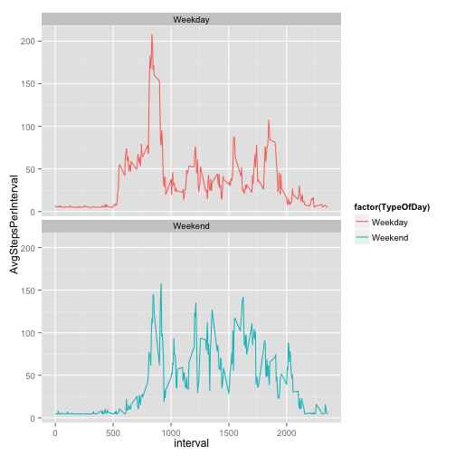

#Introduction

It is now possible to collect a large amount of data about personal movement using activity monitoring devices such as a Fitbit, Nike Fuelband, or Jawbone Up. These type of devices are part of the “quantified self” movement – a group of enthusiasts who take measurements about themselves regularly to improve their health, to find patterns in their behavior, or because they are tech geeks. But these data remain under-utilized both because the raw data are hard to obtain and there is a lack of statistical methods and software for processing and interpreting the data.

This project document makes use of data from a personal activity monitoring device. This device collects data at 5 minute intervals through out the day. The data consists of two months of data from an anonymous individual collected during the months of October and November, 2012 and include the number of steps taken in 5 minute intervals each day.

# Let's load and Process the data


```r
library(dplyr)
library(ggplot2)

#load and process
activity <- tbl_df(read.csv("activity.csv"))
```

# What is mean total number of steps taken per day?


```r
dailySteps <- activity %>%
  filter(!is.na(steps)) %>%
  group_by(date) %>%
  summarise(numSteps = sum(steps)) %>%
  mutate(Mean = mean(numSteps), Median = median(numSteps))
```
It might be best to just calculate mean() once and not have it as a var in dailySteps

Let's look at some summary statistics for the activity

```r
summary(activity)
```

```
##      steps                date          interval     
##  Min.   :  0.00   2012-10-01:  288   Min.   :   0.0  
##  1st Qu.:  0.00   2012-10-02:  288   1st Qu.: 588.8  
##  Median :  0.00   2012-10-03:  288   Median :1177.5  
##  Mean   : 37.38   2012-10-04:  288   Mean   :1177.5  
##  3rd Qu.: 12.00   2012-10-05:  288   3rd Qu.:1766.2  
##  Max.   :806.00   2012-10-06:  288   Max.   :2355.0  
##  NA's   :2304     (Other)   :15840
```

## Now create a basic histogram of the steps

```r
m <- ggplot(dailySteps, aes(x=numSteps))
m + geom_histogram(aes(fill= ..count..),binwidth=1500)
```

 

# WHAT IS THE AVERAGE DAILY ACTIVITY PATTERN?
1. Make a time series plot (i.e. type = “l”) of the 5-minute interval (x-axis) and the average number of steps taken, averaged across all days (y-axis)


```r
IntervalTimeSeries <- activity %>%
  group_by(interval) %>%
  summarise(NumRecords = n(),MeanStepsForInterval = mean(steps,na.rm=TRUE))

ITS <- ggplot(IntervalTimeSeries, aes(x=interval,y=MeanStepsForInterval))
ITS + geom_line(color = "blue")
```

 

2. Which 5-minute interval, on average across all the days in the dataset, contains the maximum number of steps?

```r
RankIntervals <- activity %>%
  group_by(interval) %>%
  summarise(MeanStepsForInterval = mean(steps,na.rm=TRUE)) %>%
  filter(min_rank(desc(MeanStepsForInterval)) <= 5) %>% #See the top 5 intervals
  arrange(desc(MeanStepsForInterval)) 
View(RankIntervals)
```
We can see that Interval:835 has the highest average number of steps, and also that the the next 4 highest intervals are all clustered around that time. Some simple algebra shows us that is time of high activity is around 2pm (840/60minsInHour = 14)

# Imputing missing values
The presence of missing days may introduce bias into some calculations or summaries of the data.
1.Calculate and report the total number of missing values in the dataset (i.e. the total number of rows with NAs)


```r
sumNA <- summarise(activity, sum = sum(is.na(steps)))
sumNA #2304
```

```
## Source: local data frame [1 x 1]
## 
##    sum
## 1 2304
```

2. Devise a strategy for filling in all of the missing values in the dataset


```r
MEAN <- summarise(activity, mean = mean(is.na(steps))) #.1311475
```

3.Replace NA step values with the mean value for 5mins window & create new data set


```r
filled <- activity %>%
  mutate(steps = replace(steps, is.na(steps), mean(steps, na.rm =TRUE))) 
```

4.Make a histogram of the total number of steps taken each day and Calculate and report the mean and median total number of steps taken per day. NOTE that filling the way that I did makes the mean=median

Calc the daily number of steps along with the mean and median

```r
dailyFilledSteps <- filled %>%
  group_by(date) %>%
  summarise(numSteps = sum(steps)) %>%
  mutate(MEAN = mean(numSteps), MEDIAN= median(numSteps))
```

Make the histogram

```r
FilledSteps<- ggplot(dailyFilledSteps, aes(x=numSteps))
FilledSteps + geom_histogram(aes(fill = ..count..),binwidth=1500) + scale_fill_gradient("Count", low = "red", high = "blue")
```

 

#Are there differences in activity patterns between weekdays and weekends?
For this part the weekdays() function may be of some help here. Use the dataset with the filled-in missing values for this part.

1.Create a new factor variable in the dataset with two levels – “weekday” and “weekend” indicating whether a given date is a weekday or weekend day.
If weekday is Saturday or Sunday, replace with ‘weekend’, else replace with ‘weekday’, use those as factors

```r
dayCategories <- filled %>%
  mutate(TypeOfDay=weekdays(as.Date(date))) %>%
  mutate(TypeOfDay = as.factor(ifelse(TypeOfDay == "Saturday" | TypeOfDay == "Sunday","Weekend","Weekday"))) %>%
  group_by(interval,TypeOfDay) %>%
  mutate(AvgStepsPerInterval = mean(steps))  
```

2.Make a panel plot containing a time series plot (i.e. type = "l") of the 5-minute interval (x-axis) and the average number of steps taken, averaged across all weekday days or weekend days (y-axis). 

```r
CategoryPlot <- ggplot(dayCategories, aes(x=interval, y= AvgStepsPerInterval))
CategoryPlot + facet_wrap(~TypeOfDay, ncol=1) + geom_line(aes(color = factor(TypeOfDay)))
```

 

